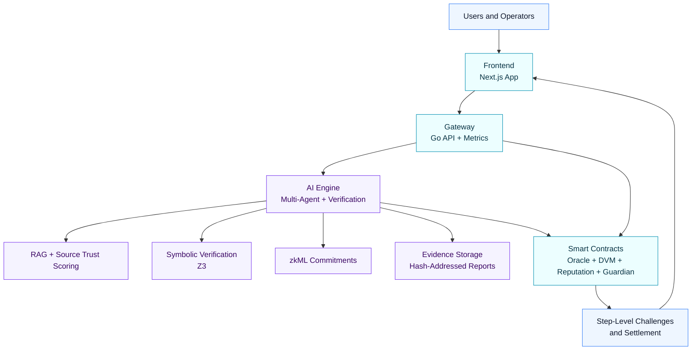

# Veritas Protocol

Veritas Protocol builds verifiable judgment infrastructure for prediction markets and governance.

Our focus is straightforward:

1. Treat AI output as untrusted until verified.
2. Make reasoning auditable and challengeable.
3. Align incentives so truthful outcomes win under adversarial pressure.

## What We Build

- Multi-agent reasoning pipelines for high-stakes market resolution.
- Neuro-symbolic verification workflows using formal logic checks.
- On-chain dispute and settlement contracts for transparent resolution.
- Operator and user interfaces for market operations and verification visibility.

## Verified Deployments

Veritas V2 core contracts are deployed and verified on BSC Testnet (Chain ID 97):

- **VeritasToken**: [`0x07F608AFf6d63b68029488b726d895c4Bb593038`](https://testnet.bscscan.com/address/0x07F608AFf6d63b68029488b726d895c4Bb593038#code)
- **VeritasOracleV2**: [`0xBE231B798821f11c09051851683301F428fe9305`](https://testnet.bscscan.com/address/0xBE231B798821f11c09051851683301F428fe9305#code)
- **VeritasDVMV2**: [`0xEa5231b0dF43c04d9D38020B89bde22644F74B0A`](https://testnet.bscscan.com/address/0xEa5231b0dF43c04d9D38020B89bde22644F74B0A#code)
- **VeritasReputationV2**: [`0x0D2B4193e78107678a5aC29d795e0EcD361aE3A7`](https://testnet.bscscan.com/address/0x0D2B4193e78107678a5aC29d795e0EcD361aE3A7#code)
- **VeritasGuardian**: [`0xEA857fD26a976AB8F0aAd5e006b5FEfaF0F30c9B`](https://testnet.bscscan.com/address/0xEA857fD26a976AB8F0aAd5e006b5FEfaF0F30c9B#code)
- **VeritasFactoryV2**: [`0xB5d29EA1E2e90A24D6506E2a6a269506a12974CC`](https://testnet.bscscan.com/address/0xB5d29EA1E2e90A24D6506E2a6a269506a12974CC#code)

## Deprecation Notice

- The FastAPI `backend` package is deprecated and retained for historical/reference purposes.
- Active production orchestration and API traffic are routed through the Go `gateway`.

## Architecture Diagram

## Current Network Focus

- BSC Testnet for deployment and protocol iteration.
- opBNB-compatible architecture for high-throughput usage.

## End-to-End Flow

1. Market is created and metadata is ingested.
2. AI engine transforms question, gathers sources, and computes trust scores.
3. Proposer/challenger/supervisor generate and arbitrate a resolution package.
4. Z3 checks symbolic consistency of reasoning steps.
5. Step hashes and evidence hashes are produced for settlement traceability.
6. Contracts receive outcome proposal and enable bounded dispute windows.
7. Frontend and gateway surface status, disputes, and verification evidence.

## Engineering Principles

- Security-first design over convenience shortcuts.
- Evidence-driven claims and reproducible outcomes.
- Explicit failure modes and observability by default.
- Small, reviewable changes over large opaque rewrites.

## Contributing

We welcome contributions from engineers, researchers, and protocol designers.

Suggested path:

1. Read the main repository documentation and architecture notes.
2. Pick an issue or propose a scoped improvement.
3. Open a pull request with tests and clear rationale.

## Security

If you discover a vulnerability, please do not open a public issue with exploit details.
Share a private report with maintainers so we can coordinate a fix responsibly.

## License

MIT, unless otherwise specified per repository.
