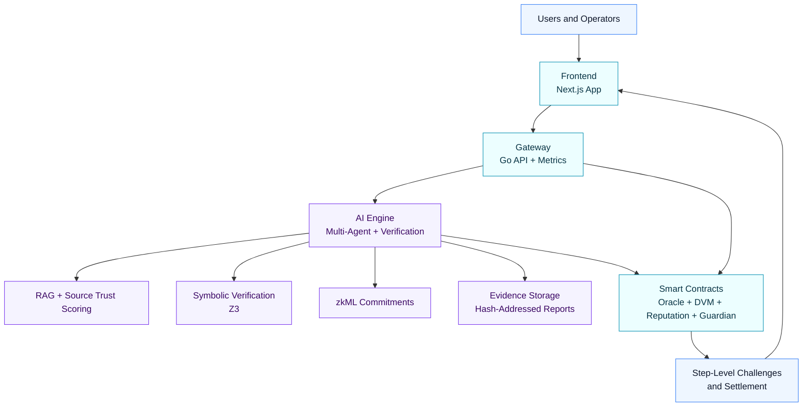

# Veritas Protocol

Veritas Protocol builds verifiable judgment infrastructure for prediction markets and governance.

Our focus is straightforward:

1. Treat AI output as untrusted until verified.
2. Make reasoning auditable and challengeable.
3. Align incentives so truthful outcomes win under adversarial pressure.

## What We Build

- Multi-agent reasoning pipelines for high-stakes market resolution.
- Neuro-symbolic verification workflows using formal logic checks.
- On-chain dispute and settlement contracts for transparent resolution.
- Operator and user interfaces for market operations and verification visibility.

## Deprecation Notice

- The FastAPI `backend` package is deprecated and retained for historical/reference purposes.
- Active production orchestration and API traffic are routed through the Go `gateway`.

## Architecture Diagram

## Current Network Focus

- BSC Testnet for deployment and protocol iteration.
- opBNB-compatible architecture for high-throughput usage.

## Engineering Principles

- Security-first design over convenience shortcuts.
- Evidence-driven claims and reproducible outcomes.
- Explicit failure modes and observability by default.
- Small, reviewable changes over large opaque rewrites.

## Contributing

We welcome contributions from engineers, researchers, and protocol designers.

Suggested path:

1. Read the main repository documentation and architecture notes.
2. Pick an issue or propose a scoped improvement.
3. Open a pull request with tests and clear rationale.

## Security

If you discover a vulnerability, please do not open a public issue with exploit details.
Share a private report with maintainers so we can coordinate a fix responsibly.

## License

MIT, unless otherwise specified per repository.
